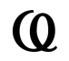
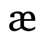

# Symbols names:

### Baloon or balao

## 

### AT

## 

### Lambda

## 

### N

## 

### Alien

## 

### X

## 

### .C

## 

### E

## 

### Spiral or Espiral

## 

### Star or Estrela

## 

### ?

## 

### Copyrigth or Copy

## 

### Nose or Nariz

## 

### XI

## 

### R

## 

### 6

## 

### bT

## 

### Emoji

## 

### Psi

## 

### C.

## 

### P

## 

### 3 or Snake or Cobra

## 

### Black star or Estrela preta

## 

### Jigsaw or Quebra-cabeça

## 

### ae

## 

### H

## 

### Omega

### 
